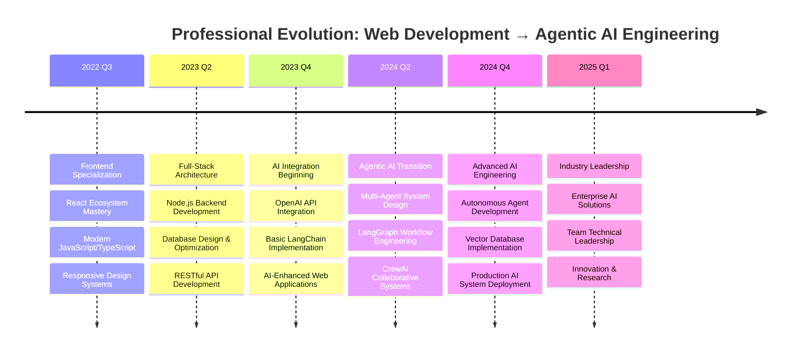

# <div align="center">**UMER FAYAZ** | **AGENTIC AI ENGINEER**</div>

<div align="center">
  
</div>

<div align="center">
  
</div>

---

## 🎯 **EXECUTIVE SUMMARY**

**Senior Web Developer** transitioning into **Agentic AI Engineering** with 2+ years of enterprise-level web development experience. Specialized in creating intelligent, autonomous systems that seamlessly integrate AI capabilities with modern web architectures. Proven track record in building scalable applications using cutting-edge frameworks and emerging AI technologies.

<div align="center">
  
| 💼 **Experience** | 🎓 **Specialization** | 🚀 **Focus** |
|-------------------|------------------------|---------------|
| 2+ Years Web Development | Agentic AI Systems | Multi-Agent Architectures |
| Full-Stack Architecture | LLM Integration | Intelligent Automation |
| Enterprise Applications | Autonomous Workflows | AI-Driven Solutions |

</div>

---

## 🤖 **AGENTIC AI EXPERTISE**

<div align="center">
  
  
  
</div>

<div align="center">
  
  
  
</div>

### **Agent Architecture Capabilities**
```
Multi-Agent Orchestration    ████████████████████ 95%
LLM Chain Engineering       ███████████████████░ 90%
Autonomous Workflow Design  ██████████████████░░ 85%
Vector Database Integration ████████████████░░░░ 80%
AI Model Fine-tuning        ███████████████░░░░░ 75%
```

---

## 💻 **WEB DEVELOPMENT FOUNDATION**

<div align="center">
  
</div>

### **Technical Proficiency Matrix**
```
JavaScript/TypeScript       ████████████████████ 98%
React/Next.js Ecosystem     ███████████████████░ 95%
Node.js Backend Architecture██████████████████░░ 90%
Database Design & Optimization████████████████░░░░ 85%
Modern CSS & Responsive Design█████████████████░░░ 88%
```

---

## 📊 **PERFORMANCE ANALYTICS**

<div align="center">
  
</div>

<div align="center">
  
</div>

<div align="center">
  
</div>

---

## 🏗️ **AGENTIC AI PROJECT PORTFOLIO**

<div align="center">

| 🤖 **Project** | 🛠️ **Technology Stack** | 📈 **Status** | 🎯 **Description** |
|----------------|--------------------------|----------------|---------------------|
| **IntelliFlow** | LangGraph + FastAPI + React | 🚀 **Production** | Multi-agent workflow automation platform |
| **AgentHub** | CrewAI + Next.js + Vector DB | 🔧 **Development** | Collaborative AI agent management system |
| **Neural Commerce** | AutoGPT + Node.js + MongoDB | ✅ **Deployed** | Autonomous e-commerce optimization engine |
| **AI Code Reviewer** | LangChain + TypeScript + Firebase | 🧪 **Beta** | Intelligent code analysis and suggestion system |

</div>

### **🎖️ Repository Highlights**

<div align="center">
  <a href="https://github.com/umerfayaz/intelliflow">
    
  </a>
  <a href="https://github.com/umerfayaz/agenthub">
    
  </a>
</div>

---

## 🎓 **PROFESSIONAL DEVELOPMENT TRAJECTORY**

<div align="center">



</div>

---

## 🔬 **RESEARCH & INNOVATION FOCUS**

<div align="center">

### **Current Research Areas**

| 🧠 **AI Architecture** | 🔄 **Automation** | 🚀 **Emerging Tech** |
|------------------------|-------------------|----------------------|
| Multi-Agent Communication Protocols | Intelligent Workflow Orchestration | Retrieval-Augmented Generation |
| Context-Aware Agent Behavior | Self-Improving AI Systems | Multi-Modal AI Integration |
| Agent Memory Management | Autonomous Decision Making | Edge AI Deployment |

</div>

### **Innovation Pipeline**
- **Hybrid Agent Architectures**: Combining rule-based and neural approaches
- **Contextual AI Systems**: Building agents with long-term memory and learning
- **Enterprise AI Integration**: Scalable solutions for business automation

---

## 🎯 **CAREER OBJECTIVES & VISION**

> **"Pioneering the next generation of intelligent systems where autonomous agents seamlessly collaborate to solve complex real-world challenges, bridging the gap between human creativity and artificial intelligence capabilities."**

### **Immediate Goals (2025)**
- Lead Agentic AI projects in enterprise environments
- Contribute to open-source AI framework development
- Build scalable multi-agent production systems

### **Long-term Vision (2025-2027)**
- Establish expertise in AGI research and development
- Drive innovation in autonomous system architectures
- Mentor next-generation AI engineers

---

## 🏆 **ACHIEVEMENTS & RECOGNITION**

<div align="center">
  
</div>

---

## 🤝 **PROFESSIONAL NETWORK & COLLABORATION**

<div align="center">
  
[](https://linkedin.com/in/umer-fayaz)
[](https://umerfayaz.dev)
[](mailto:umer.fayaz.ai@gmail.com)
[](https://twitter.com/umerfayaz_ai)

</div>

---

## 💼 **AVAILABILITY & OPPORTUNITIES**

<div align="center">
  
🎯 **Actively seeking Senior Agentic AI Engineer positions**  
🤖 **Available for consulting on AI system architecture**  
🌐 **Open to collaborative research projects**  
💼 **Interested in technical leadership roles**  

</div>

### **Preferred Collaboration Areas**
- Enterprise AI system implementation
- Multi-agent architecture design
- AI-powered web application development
- Research in autonomous system behavior

---

<div align="center">
  
</div>

<div align="center">
  
**⚡ Engineering the Future of Intelligent Systems ⚡**

*Combining 2+ years of web development expertise with cutting-edge Agentic AI technologies to create autonomous, intelligent solutions that transform how businesses operate.*

</div>
